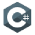

  

 

<h1 align="center"> Hi there 👋 </h1>

  
Actuellement je suis étudiant en 2ème année de BUT Informatique en option RA-DWM.

### :point_right: Compétences
#### Langages / Frameworks
&nbsp;&nbsp;
&nbsp;&nbsp; 
&nbsp;&nbsp; 
&nbsp;&nbsp;
&nbsp;&nbsp; 
&nbsp;&nbsp; 
&nbsp;&nbsp; 
&nbsp;&nbsp; 

#### Outils
&nbsp;
&nbsp;&nbsp; 
&nbsp;&nbsp; 
&nbsp;&nbsp; 

 

#### Me contacter :

  
  

  
  
